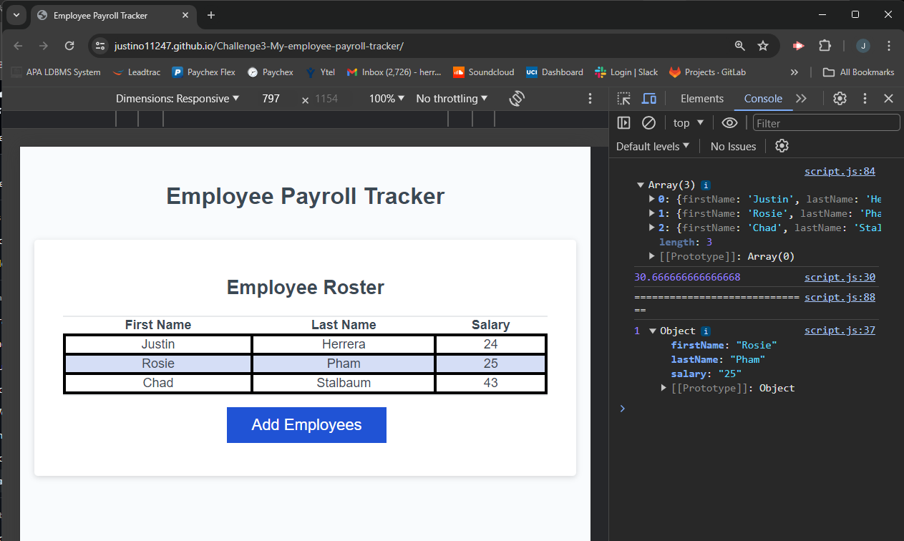

# Challenge3-My-employee-payroll-tracker
An application that tracks employee's names and salaries with a little extra in the console.

## Table of Contents

- [About](#about)
- [The Purpose](#the-purpose)
- [Usage](#usage)

## About 

This is the **Module 03 Challenge Project**. The point of this project was to add my new knowledge of javascript code to the existing starter code that was given to me. The finished product is an employee tracker that displays employee imformation as well as logging the average salary in the console. 
 

 

## The Purpose 

The code that I added was made to gather user entered data about each employee including their first name, last name, and salary. After the data was collected, it was meant to be displayed on a table on the page as well as give extra information once the user opens the console log.

## Usage
 
 This webpage is to be used as a salary tracker for employees. The user will be prompted to add an employee. Once clicked they will be asked to enter the employee's name and salary. After they have finished adding as many employees they would like, the data is displayed on a table. If the user were to open the console, they would also find that it displays the average salary of the employees as well as picks a random employee from the table to display their information.

  ### Here is a link to the finished webpage.
### <a href="https://justino11247.github.io/Challenge3-My-employee-payroll-tracker/">**`Click Here`**</a>

